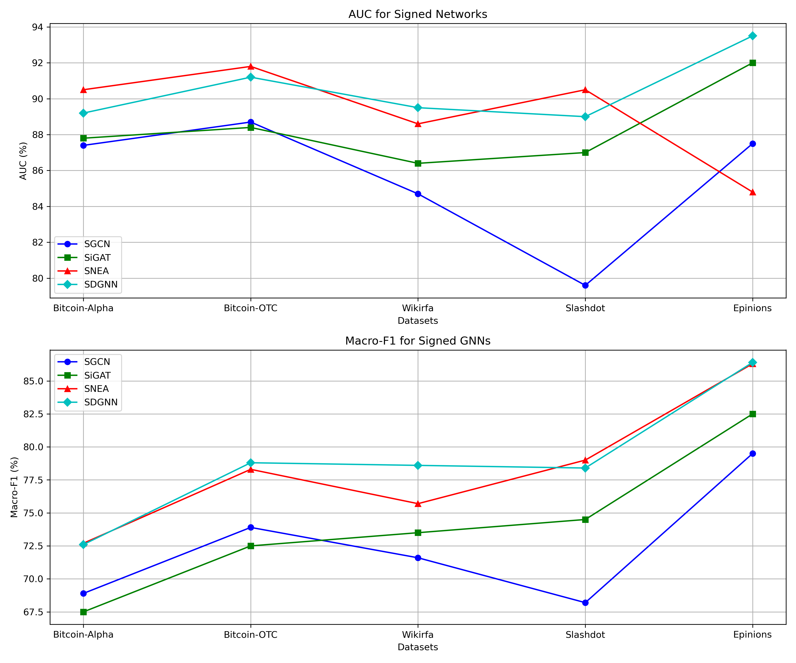

# Si-GNN

## Overview

**This is a repo for Baselines and Benchmarks of Signed Neural Network**

- **LightSGCN is conducted personally [[link]](https://github.com/akarinmoe/LightSGCN)**

## Result

- **Link Sign Prediction Results (AUC, Macro-F1) for Signed Networks** 

$$
\begin{array}{cccccc}
\hline
\textbf{Method} & \textbf{Bitcoin-Alpha} & \textbf{Bitcoin-OTC} & \textbf{Wiki-Rfa} & \textbf{Slashdot} & \textbf{Epinions} \\
\hline
\textbf{SGCN} & \mathbf{(87.4 \pm 0.9, 68.9 \pm 0.9)} & \mathbf{(88.7 \pm 0.7, 73.9 \pm 1.1)} & \mathbf{(84.7 \pm 0.3, 71.6 \pm 0.5)} & \mathbf{(79.6 \pm 0.4, 68.2 \pm 0.5)} & \mathbf{(87.5 \pm 0.5, 79.5 \pm 0.2)} \\
\textbf{SiGAT} & \mathbf{(87.8 \pm 1.2, 67.5 \pm 1.8)} & \mathbf{(88.4 \pm 0.5, 72.5 \pm 0.8)} & \mathbf{(86.4 \pm 0.3, 73.5 \pm 0.6)} & \mathbf{(87.0 \pm 0.5, 74.5 \pm 0.6)} & \mathbf{(92.0 \pm 0.4, 82.5 \pm 0.5)} \\
\textbf{SNEA} & \mathbf{(90.5 \pm 1.0, 72.7 \pm 2.9)} & \mathbf{(91.8 \pm 0.4, 78.3 \pm 0.4)} & \mathbf{(88.6 \pm 1.1, 75.7 \pm 2.0)} & \mathbf{(90.5 \pm 0.2, 79.0 \pm 0.2)} & \mathbf{(84.8 \pm 0.1, 86.3 \pm 0.2)} \\
\textbf{SDGNN} & \mathbf{(89.2 \pm 0.1, 72.6 \pm 0.4)} & \mathbf{(91.2 \pm 0.7, 78.8 \pm 0.8)} & \mathbf{(89.5 \pm 0.2, 78.6 \pm 0.3)} & \mathbf{(89.0 \pm 0.2, 78.4 \pm 0.4)} & \mathbf{(93.5 \pm 0.2, 86.4 \pm 0.2)} \\
\hline
\end{array}
$$

- **Line Chart of (AUC, Macro-F1)**

## Dataset & Benchmark

- **Bitcoin-Alpha** and **Bitcoin-OTC** are two signed graphs extracted from bitcoin trading platforms. Since bitcoin tradings are anonymous, people give trust or not-trust tags to others in order to enhance security.
- **Slashdot** is a technology-related news website where users can create friend or foe relationships with others.
- **Epinions** is a consumer review site with trust and distrust relationships between users.

$$
\begin{array}{cccc}
\hline
\textbf{Datasets} & \textbf{Bit.Alpha} & \textbf{Bit.OTC} &\textbf{Wiki-Rfa} & \textbf{Slashdot} & \textbf{Epinions} \\
\hline
|\mathcal{V}| & \mathbf{3,783} & \mathbf{5,881} & \mathbf{7,634} & \mathbf{82,140} & \mathbf{131,580} \\
|\mathcal{E}^+| & \mathbf{22,650} & \mathbf{32,029} & \mathbf{135,753} & \mathbf{380,933} & \mathbf{589,888} \\
|\mathcal{E}^-| & \mathbf{1,536} & \mathbf{3,563} & \mathbf{37,579} & \mathbf{119,548} & \mathbf{121,322}\\
\hline
\end{array}
$$

## Baseline Models

### SGCN

SGCN incorporates balance theory to effectively model and aggregate information in signed networks with both positive and negative links.

### SiGAT

SiGAT integrates social theories like balance and status theory, using motif-based attention mechanisms to effectively model signed directed networks for tasks like signed link prediction.

### SNEA

SNEA employs masked self-attention mechanisms and balance theory to differentiate and aggregate positive and negative link information, enabling effective representation learning for signed networks.

### SDGNN

SDGNN utilizes balance and status theories to aggregate and propagate information through multiple layers while reconstructing signs, directions, and triangles to learn effective node embeddings.

### SLGNN

SLGNN leverages spectral graph theory and graph signal processing to design low-pass and high-pass convolution filters, integrating them with a self-gating mechanism to effectively model positive and negative links, enhancing structural representation in signed graphs.

### LightSGCN

LightSGCN is a simplified signed graph convolution network that employs linear propagation guided by balance theory, removing nonlinear transformations to improve efficiency and interpretability while achieving superior performance in link sign prediction tasks.

## Reference

[SGCN](https://arxiv.org/pdf/1808.06354)

[SiGAT](https://arxiv.org/pdf/1906.10958)

[SNEA](https://ojs.aaai.org/index.php/AAAI/article/view/5911/5767)

[SDGNN](https://arxiv.org/pdf/2101.02390)

[SLGNN](https://ojs.aaai.org/index.php/AAAI/article/view/25565/25337)

[LightSGCN](https://dl.acm.org/doi/pdf/10.1145/3477495.3531917)

[PyGSD](https://arxiv.org/pdf/2202.10793)